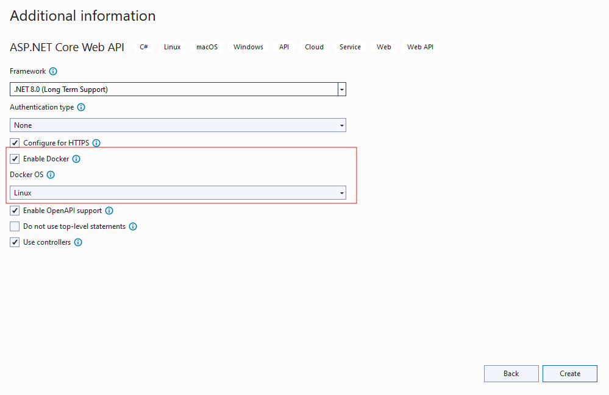
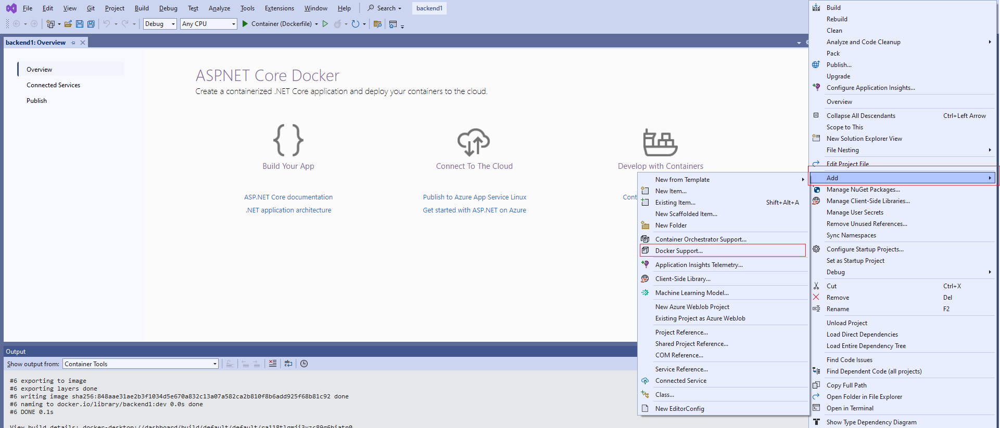

ASP Dot Net 8.0 and React.ts with Docker compose
Create root folder name like `asp-react-nginx-compose` or other suit able.

In it create 3 folders and 1 file in root folder :
#### The Project structure is:
```plaintext
app
├── backend
├── docker-compose.yml
├── frontend
└── nginx

4 directories, 1 file
```
Here is the reference of project public repo in github [Source Code](https://github.com/usman-jamil/dev-docs/tree/main) of given example project asp-react-nginx-compose.

### ASP.NET 8.0 and React.ts with Docker Compose

This guide explains how to set up a project structure using ASP.NET, React, and Nginx within Docker containers. Below are detailed steps for configuring your development environment, including Docker installation.

* For enabling Docker support in project it is important Docker is install and running in Laptop and computer.
## Installing Docker

Before you start setting up your project, you need to install Docker on your machine if it isn't already installed. Docker allows you to create, deploy, and run applications by using containers.

### For Windows

1. Download Docker Desktop from the [official Docker website](https://www.docker.com/products/docker-desktop).
2. Run the installer and follow the on-screen instructions.
3. Ensure that the "Windows Subsystem for Linux" (WSL2) feature is enabled on your machine.
4. After installation, launch Docker Desktop and sign in or create a Docker account if prompted.

### For macOS

1. Download Docker Desktop for Mac from the [official Docker website](https://www.docker.com/products/docker-desktop).
2. Open the downloaded `.dmg` file and drag the Docker icon to your Applications folder.
3. Open Docker from your Applications to complete the installation.
4. Docker may request your password to install a helper tool; provide your password to continue.

### For Linux

The installation commands can vary depending on your Linux distribution. Here's how you can install Docker on Ubuntu:

1. Update your existing list of packages:
```bash
  $ sudo apt update

  $ sudo apt install apt-transport-https ca-certificates curl software-properties-common

  $ curl -fsSL https://download.docker.com/linux/ubuntu/gpg | sudo apt-key add -

  $ sudo add-apt-repository "deb [arch=amd64] https://download.docker.com/linux/ubuntu $(lsb_release -cs) stable"

  $ sudo apt update

  $ apt-cache policy docker-ce

  $ sudo apt install docker-ce

docker run hello-world
```
## Backend Configuration

### Creating the ASP.NET Project

Navigate into the `backend` folder and create a new ASP.NET project. You can add Docker support during the project creation or after the project has been created.
#### During Project Creation
1. Mark check true to Enable Docker
2. Select Docker OS: Linux



#### After Project Creation

Right-click on the project name in your IDE, then:

1. Click "Add"
2. Select "Docker Support"



This will generate a `Dockerfile` in your project directory, which might look something like this:
```Dockerfile
#See https://aka.ms/customizecontainer to learn how to customize your debug container and how Visual Studio uses this Dockerfile to build your images for faster debugging.
FROM mcr.microsoft.com/dotnet/aspnet:8.0 AS base
USER app
WORKDIR /app
EXPOSE 8080
EXPOSE 8081
FROM mcr.microsoft.com/dotnet/sdk:8.0 AS build
ARG BUILD_CONFIGURATION=Release
WORKDIR /src
COPY ["backend.csproj", "."]
RUN dotnet restore "./backend.csproj"
COPY . .
WORKDIR "/src/."
RUN dotnet build "./backend.csproj" -c $BUILD_CONFIGURATION -o /app/build
FROM build AS publish
ARG BUILD_CONFIGURATION=Release
RUN dotnet publish "./backend.csproj" -c $BUILD_CONFIGURATION -o /app/publish /p:UseAppHost=false
FROM base AS final
WORKDIR /app
COPY --from=publish /app/publish .
ENTRYPOINT ["dotnet", "backend.dll"]
```

## Frontend Configuration

In the `frontend` folder, create a `Dockerfile` with the following content:
```Dockerfile
FROM node:21.5.0-alpine
WORKDIR /app
COPY package.json ./
RUN npm install
COPY . .
RUN npm run build
RUN npm install -g serve
CMD ["serve", "-s", "build", "-l", "4000"]
EXPOSE 4000
```

## Docker Compose Configuration

At the root of the project, create a `docker-compose.yml` file to define and run multi-container Docker applications. Here is a sample configuration:
```yml
version: '3.8'
services:
  backend:
    build:
      context: ./backend
      dockerfile: Dockerfile
  frontend:
    build:
      context: ./frontend
      dockerfile: Dockerfile
    depends_on:
      - backend
  nginx:
    image: nginx:alpine
    ports:
      - "80:80"
    volumes:
      - ./nginx:/etc/nginx/conf.d
    depends_on:
      - frontend
```

## Nginx Configuration

Create a `default.conf` file in the `nginx` folder with the following configuration:
```nginx
server {
    listen 80;
    location /api {
        proxy_pass http://backend:8080;
        proxy_http_version 1.1;
        proxy_set_header Upgrade $http_upgrade;
        proxy_set_header Connection keep-alive;
        proxy_set_header Host $host;
        proxy_cache_bypass $http_upgrade;
        proxy_set_header X-Forwarded-For $proxy_add_x_forwarded_for;
        proxy_set_header X-Forwarded-Proto $scheme;
    }
    location / {
        proxy_pass http://frontend:4000;
        proxy_http_version 1.1;
        proxy_set_header Upgrade $http_upgrade;
        proxy_set_header Connection keep-alive;
        proxy_set_header Host $host;
        proxy_cache_bypass $http_upgrade;
        proxy_set_header X-Forwarded-For $proxy_add_x_forwarded_for;
        proxy_set_header X-Forwarded-Proto $scheme;
    }
}
```

### Building All the Images

To build all the images specified in your `docker-compose.yml` file, use the following command from the root directory of your project (where your `docker-compose.yml` is located):

```bash
docker-compose build
```
This command will build all the Docker images for the services defined in your `docker-compose.yml`.

### Running the Application

To start all the services defined in your `docker-compose.yml` file, use the following command:
```bash
docker-compose up
```

This will start all the containers. If you want to run them in detached mode (in the background), you can add the `-d` flag:
```bash
docker-compose up -d
```

### Stopping the Application

To stop the running containers without removing them, you can use:
```bash
docker-compose stop
```

### Removing All the Images

To remove all images created by the build process, you first need to stop and remove the containers, networks, volumes, and images associated with your `docker-compose.yml` file. Here are the commands to do that:

1. Stop the containers if they are running:
```bash
docker-compose down
```

2. Remove the images:
```bash
docker-compose down --rmi all
```

Alternatively, if you want to remove all Docker images (including those not associated with this project), you can use:
```bash
docker image prune -a
```

This command will remove all images not associated with a running container, or:
```bash
docker rmi $(docker images -a -q)
```

This command forces the removal of all images by getting the IDs of all images and passing them to `docker rmi`. 